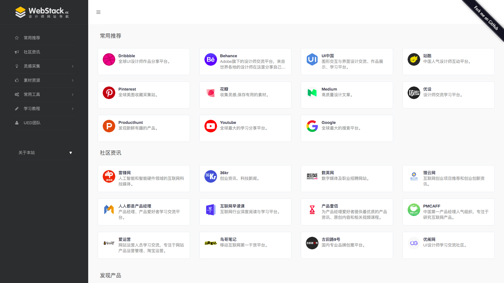
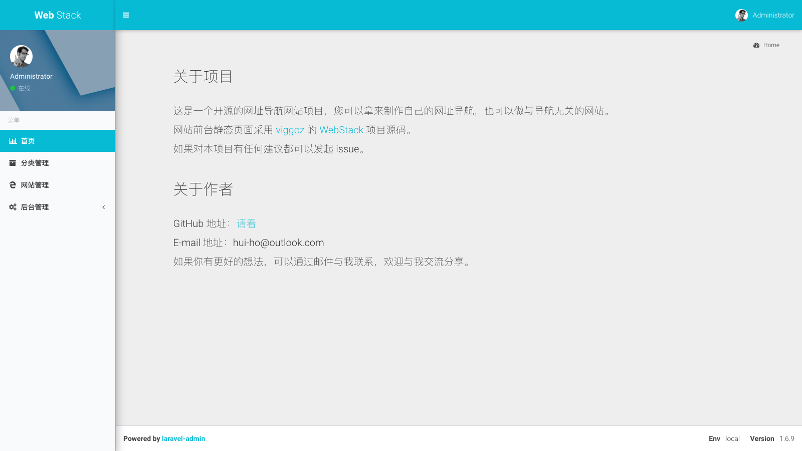
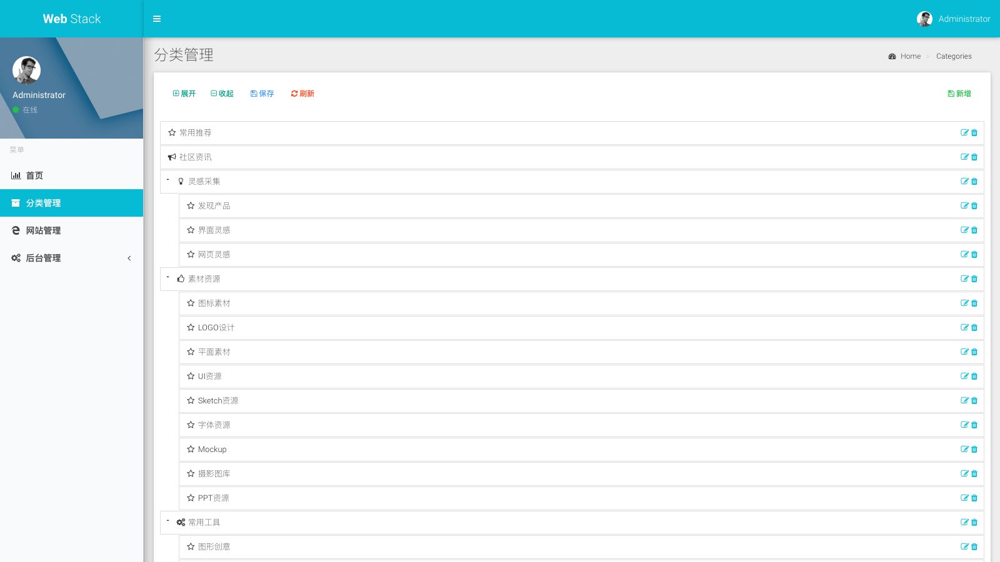
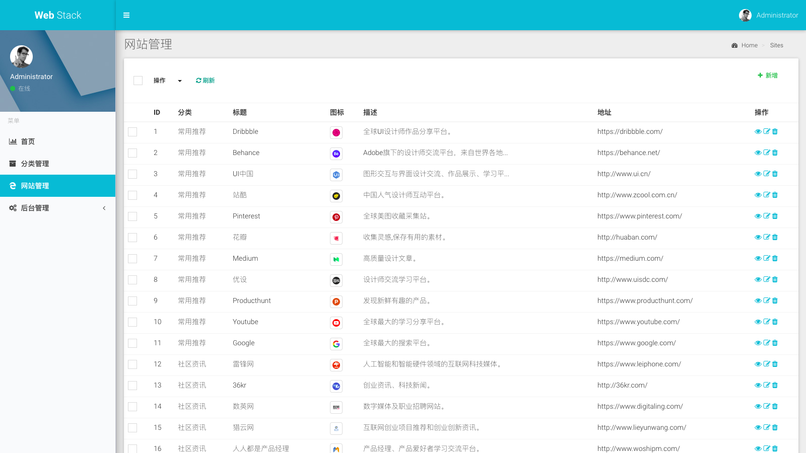

# WebStack-Laravel

一个开源的网址导航网站项目，具备完整的前后台，您可以拿来制作自己的网址导航。




## 部署

克隆代码：

```shell
git clone https://github.com/hui-ho/WebStack-Laravel.git
```

安装依赖：

```shell
$ composer install
```

编辑配置：

```
$ cp .env.example .env
```

```
...
DB_DATABASE=database
DB_USERNAME=username
DB_PASSWORD=password
...
```

生成 KEY：

```shell
$ php artisan key:generate  
```

迁移数据：

```shell
php artisan migrate:refresh --seed
```

本地测试：

```shell
$ php artisan serve
```

安装完成：http://127.0.0.1:8000

> 有些朋友对部署表示有压力，但这和一般的 Laravel 应用是没有区别的，线上环境可以参考：https://github.com/summerblue/laravel-ubuntu-init


## 使用

后台地址：http://domain/admin

默认用户：admin

默认密码：admin








## 其他

本应用预设了一些站点数据，可以使用以下命令清除：

```shell
$ php artisan webstack:clean
```


## 感谢

前端设计：[**WebStackPage**](https://github.com/WebStackPage/WebStackPage.github.io)

后台框架：[**laravel-admin**](https://github.com/z-song/laravel-admin)


## License

MIT